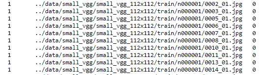
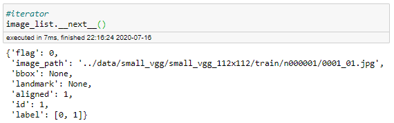

# 1. Dataset 

- 참고: https://github.com/deepinsight/insightface/issues/791
- 참고: https://github.com/deepinsight/insightface/issues/256
___

## 1.1. dataset download
- vgg2 face dataset: http://www.robots.ox.ac.uk/~vgg/data/vgg_face2/
- [download dataset for ubuntu](https://github.com/shiney5213/Project-Face_Recognition/blob/master/data_src/1.1.get_dataset_on_ubuntu.py)
 

## 1.2. face detection & align 112 x 112
- mtcnn 이용
- source: 
- 

## 1.3. dir to lst 

- image file에 대한 정보를 나타내는 파일
- align되었는지(1), image path, label로 구성
- 

## 1.4. property
- num_classes, img_size, img_size
- vgg2_face_dataser
  -  8631, 112, 112

## 1.5. face to rec, idx
### 1.5.1. idx
- image에 대한 정보를 저장
- img_id, s로 구성
- 

### 1.5.2.idx 만들기
- lst file에서 image정보를 불러와 image_list 만들기
- 
- 개별 이미지에 대한 정보 (item.flag =0)
    - HEADER(flag=0, label=[0, 1], id=151, id2=0)
    - flag: 개별 이미지
    - label: [ label, alignde]
    - id : img_index (아래 코드에서 item[0]과 같음.)

```
if item.aligned:
	with open(fullpath, 'rb') as fin:
		img = fin.read()
s = mx.recordio.pack_img(header, img, quality=args.quality, img_fmt=args.encoding)
	       
record.write_idx(item[0], s)
```

- 디렉터리에 대한 메타 정보를 저장 (item.flag = 2)
    -  HEADER(flag=2, label=[537.0, 564.0], id=595, id2=0)
    -  flag: 메타 정보
    -  label: [id_start , id_end] (같은 label인 img index)

```
s = mx.recordio.pack(header, b'')

record.write_idx(item[0], s)
```
### 1.5.2. rec
```
record = mx.recordio.MXIndexedRecordIO(os.path.join(working_dir, fname_idx),
                                       os.path.join(working_dir, fname_rec), 'w')
                                       
record.write_idx(item[0], s)
```
### 1.5.3. idx와 rec
- 두 개의 파일을 이용해서 이미지에 대한 메타 정보와 이미지를 가져올 수 있음.

```
header, s = recordio.unpack(imgrec.read_idx(1))
img = mx.image.imdecode(s).asnumpy() 
```
